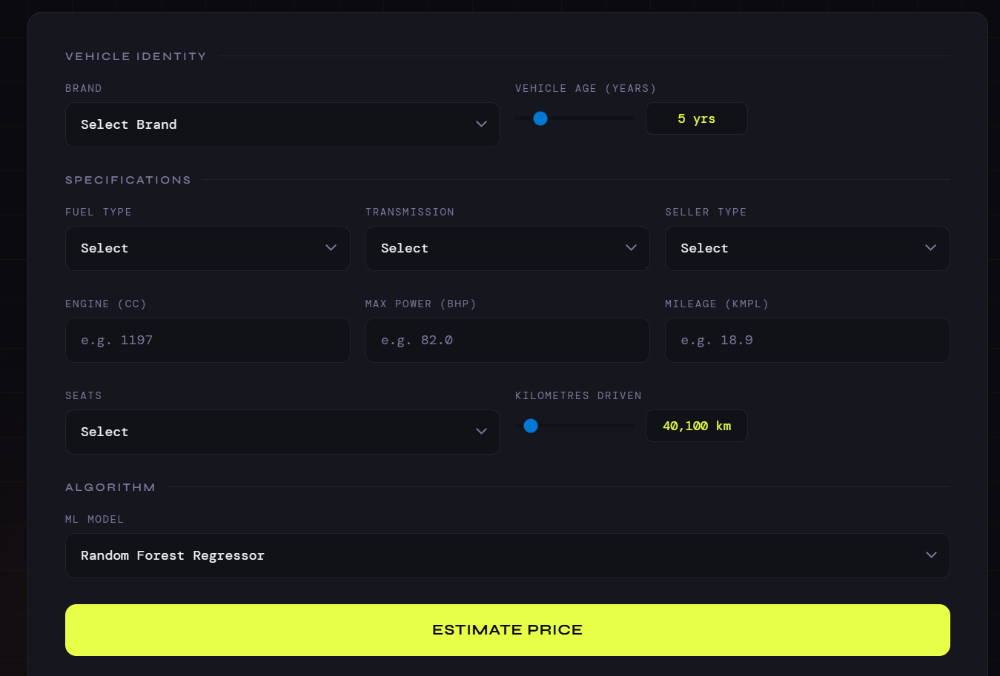
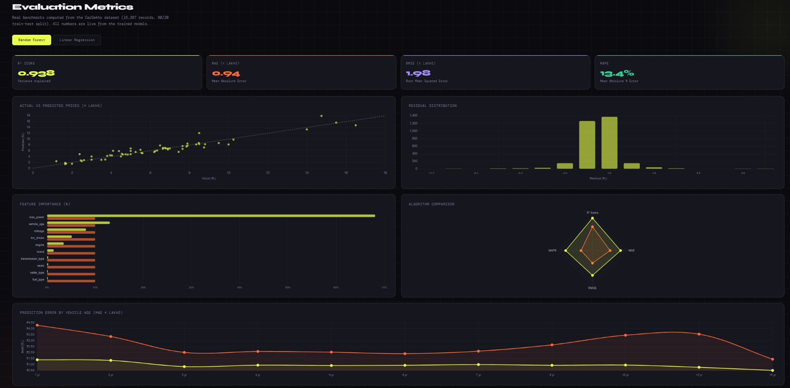

<div align="center">

# 🚗 AutoVal
### Used Car Resale Price Estimator

[](https://python.org)
[](https://flask.palletsprojects.com)
[](https://scikit-learn.org)
[](LICENSE)

<br/>

**A full-stack web application that predicts the resale price of used cars in real-time.**  
Built with Flask, scikit-learn, and a dark-themed interactive dashboard.

<br/>

</div>

---

## 📌 Table of Contents

- [Overview](#-overview)
- [Live Demo Preview](#-live-demo-preview)
- [Features](#-features)
- [Model Performance](#-model-performance)
- [Tech Stack](#-tech-stack)
- [Project Structure](#-project-structure)
- [Getting Started](#-getting-started)
- [API Reference](#-api-reference)
- [Dataset](#-dataset)
- [How It Works](#-how-it-works)

---

## 🧠 Overview

**AutoVal** takes 10 real-world vehicle parameters and predicts the resale price using two trained ML models — a **Random Forest Regressor** (R² = 0.938) and a **Linear Regression** baseline — both trained on **15,397 real CarDekho transactions**.

The app features a live metrics dashboard that shows actual vs predicted prices, residual distributions, feature importance, and prediction error by vehicle age — all fetched dynamically from the Flask backend.

---

## 🖥️ Live Demo Preview

> The app runs locally. Below are actual screenshots of the UI:

<br/>

### 🔷 Price Prediction Form

<p align="center">
  
  <br/>
  <em>Real-time car price estimation with confidence interval and feature insights</em>
</p>

<br/>

### 📊 Metrics Dashboard

<p align="center">
  
  <br/>
  <em>Interactive ML performance dashboard with multiple evaluation metrics and charts</em>
</p>

---

## ✨ Features

| Feature | Description |
|---|---|
| 🎯 **Real ML Prediction** | Random Forest (R²=0.938) + Linear Regression trained on 15,397 records |
| ⚡ **Instant Estimates** | Sub-second predictions via Flask REST API |
| 📊 **Live Metrics Dashboard** | 5 interactive Chart.js charts — all data fetched from backend |
| 🔍 **Price Influencers** | Shows which factors pushed the price up or down |
| 📉 **Confidence Score** | Per-prediction confidence interval with animated bar |
| 🔀 **Algorithm Toggle** | Switch between RF and LR — charts update live |
| 📱 **Responsive UI** | Works on desktop and mobile |
| 🔁 **Retrain Anytime** | Run `train.py` with new data to update everything |

---

## 📈 Model Performance

Both models trained on CarDekho dataset · 80/20 train-test split · random_state=42

| Metric | 🌲 Random Forest | 📉 Linear Regression |
|:---|:---:|:---:|
| **R² Score** | **0.938** | 0.689 |
| **MAE (₹ Lakhs)** | **0.94** | 2.45 |
| **RMSE (₹ Lakhs)** | **1.98** | 4.46 |
| **MAPE** | **13.4%** | 40.1% |

<br/>

### 🏆 Top Feature Importances (Random Forest)
```
max_power    ████████████████████████████████████  68.1%
vehicle_age  ███████                               13.0%
mileage      ████                                   8.1%
km_driven    ███                                    5.1%
engine       ██                                     3.5%
brand        █                                      1.4%
seats        ▌                                      0.5%
```

> 💡 **Key insight:** Max power (bhp) is by far the strongest predictor of resale price — high-performance cars retain value significantly better than low-power equivalents regardless of age or mileage.

---

## 🛠️ Tech Stack

**Backend**
- [Flask 3.0](https://flask.palletsprojects.com/) — REST API server
- [scikit-learn 1.4](https://scikit-learn.org/) — ML models
- [pandas](https://pandas.pydata.org/) — data processing
- [joblib](https://joblib.readthedocs.io/) — model serialization

**Frontend**
- Vanilla HTML / CSS / JS — zero frontend framework dependency
- [Chart.js 4.4](https://www.chartjs.org/) — 5 interactive charts
- Google Fonts — Syne + DM Mono
- Fully dark-themed responsive UI

---

## 📁 Project Structure

```
AutoVal/
│
├── app.py                    # Flask server — API routes, loads trained models
├── train.py                  # Training pipeline — run once to generate model files
├── requirements.txt          # Python dependencies
├── cardekho_dataset.csv      # Source dataset
│
├── templates/
│   └── index.html            # Frontend — form + metrics dashboard
│
└── (generated after running train.py)
    ├── rf_model.pkl           # Trained Random Forest
    ├── lr_model.pkl           # Trained Linear Regression
    ├── scaler.pkl             # StandardScaler for LR
    ├── features.pkl           # Feature name list
    ├── encoder_classes.json   # Label encoder mappings
    └── metrics.json           # Evaluation metrics + chart data
```

---

## 🚀 Getting Started

### Prerequisites
- Python 3.8+
- pip

### 1. Clone the repository

```bash
git clone https://github.com/mayankagarwal-01/AutoVal.git
cd AutoVal
```

### 2. Create and activate virtual environment

```bash
python3 -m venv venv

# macOS / Linux
source venv/bin/activate

# Windows
venv\Scripts\activate
```

### 3. Install dependencies

```bash
pip install --no-user -r requirements.txt
```

### 4. Train the models

```bash
python train.py --data cardekho_dataset.csv
```

<details>
<summary><b>Expected training output</b></summary>

```
── AutoVal Training Pipeline ──────────────────────────────────
[1/5] Loading & cleaning data...
      Loaded 15,397 rows, 11 columns after cleaning.
[2/5] Encoding categoricals...
[3/5] Splitting train / test (80 / 20)...
      Train: 12,317   Test: 3,080
[4/5] Training models...
      → Random Forest Regressor...
      → Linear Regression (with StandardScaler)...
[5/5] Saving artefacts...

── Results ────────────────────────────────────────────────────
  Random Forest:      R²=0.938  MAE=₹0.94L  RMSE=₹1.98L  MAPE=13.4%
  Linear Regression:  R²=0.689  MAE=₹2.45L  RMSE=₹4.46L  MAPE=40.1%

  Top 5 feature importances (RF):
    max_power              68.1%
    vehicle_age            13.03%
    mileage                8.08%
    km_driven              5.13%
    engine                 3.48%

  Saved: rf_model.pkl  lr_model.pkl  scaler.pkl
         features.pkl  encoder_classes.json  metrics.json

── Done. Run `python app.py` to start the server. ─────────────
```

</details>

### 5. Start the server

```bash
python app.py
```

### 6. Open in browser

```
http://localhost:5000
```

---

## 🔌 API Reference

| Method | Endpoint | Description |
|---|---|---|
| `GET` | `/` | Serves the frontend |
| `POST` | `/api/predict` | Returns predicted price, range, confidence, factors |
| `GET` | `/api/metrics?algo=rf\|lr` | R², MAE, RMSE, MAPE |
| `GET` | `/api/metrics/scatter?algo=rf\|lr` | Actual vs predicted scatter data |
| `GET` | `/api/metrics/residuals?algo=rf\|lr` | Residual histogram data |
| `GET` | `/api/metrics/importance` | Feature importance for both models |
| `GET` | `/api/metrics/age-error` | MAE by vehicle age |
| `GET` | `/api/encoders` | Valid values for all categorical fields |
| `GET` | `/api/health` | Health check |

<details>
<summary><b>📋 POST /api/predict — Request & Response</b></summary>

**Request body:**
```json
{
  "brand": "Hyundai",
  "vehicle_age": 6,
  "km_driven": 45000,
  "seller_type": "Individual",
  "fuel_type": "Petrol",
  "transmission_type": "Manual",
  "mileage": 18.9,
  "engine": 1197,
  "max_power": 82.0,
  "seats": 5,
  "model": "rf"
}
```

**Response:**
```json
{
  "price": 5.42,
  "price_low": 4.99,
  "price_high": 5.85,
  "confidence": 88.3,
  "model_name": "Random Forest Regressor",
  "factors": [
    { "name": "Brand",             "impact": 1,  "label": "Hyundai" },
    { "name": "Vehicle Age",       "impact": 0,  "label": "6 yrs"   },
    { "name": "Fuel Type",         "impact": 0,  "label": "Petrol"  },
    { "name": "Transmission",      "impact": 0,  "label": "Manual"  },
    { "name": "Max Power",         "impact": 0,  "label": "82.0 bhp"},
    { "name": "Kilometres Driven", "impact": 0,  "label": "45k km"  }
  ]
}
```

</details>

---

## 📦 Dataset

**CarDekho Used Car Dataset**

- **Source:** [Kaggle — nehalbirla/vehicle-dataset-from-cardekho](https://www.kaggle.com/datasets/nehalbirla/vehicle-dataset-from-cardekho)
- **Records:** 15,411 → 15,397 after cleaning
- **Features used:** 10
- **Target:** `selling_price` (converted to ₹ Lakhs)

| Feature | Type | Values / Range |
|---|---|---|
| `brand` | categorical | 32 brands (Maruti, Hyundai, BMW...) |
| `vehicle_age` | integer | 0 – 29 years |
| `km_driven` | integer | 100 – 500,000 km |
| `seller_type` | categorical | Individual / Dealer / Trustmark Dealer |
| `fuel_type` | categorical | Petrol / Diesel / CNG / LPG / Electric |
| `transmission_type` | categorical | Manual / Automatic |
| `mileage` | float | 4.0 – 33.5 kmpl |
| `engine` | integer | 793 – 6,592 cc |
| `max_power` | float | 38.4 – 626.0 bhp |
| `seats` | integer | 2 – 9 |

---

## ⚙️ How It Works

```
User fills form
      │
      ▼
POST /api/predict
      │
      ▼
app.py encodes categoricals
(brand → int, fuel → int, etc.)
      │
      ▼
Builds pandas DataFrame
with correct feature names
      │
      ├──── model = "rf" ────► rf_model.predict(X)
      │                              │
      └──── model = "lr" ────►  scaler.transform(X)
                                     │
                                lr_model.predict(X_scaled)
      │
      ▼
Returns price, confidence range, influencing factors
      │
      ▼
Frontend renders result panel
Metrics charts fetch from /api/metrics/* endpoints
```

---

<div align="center">

Contributors 
[Mayank Agarwal]
[Shreyansh Verma]
[Suryansh Panda]
[Janhavi Maheshwari]
[Yashovardhan Singh]
[Khushbu Raj]

</div>
